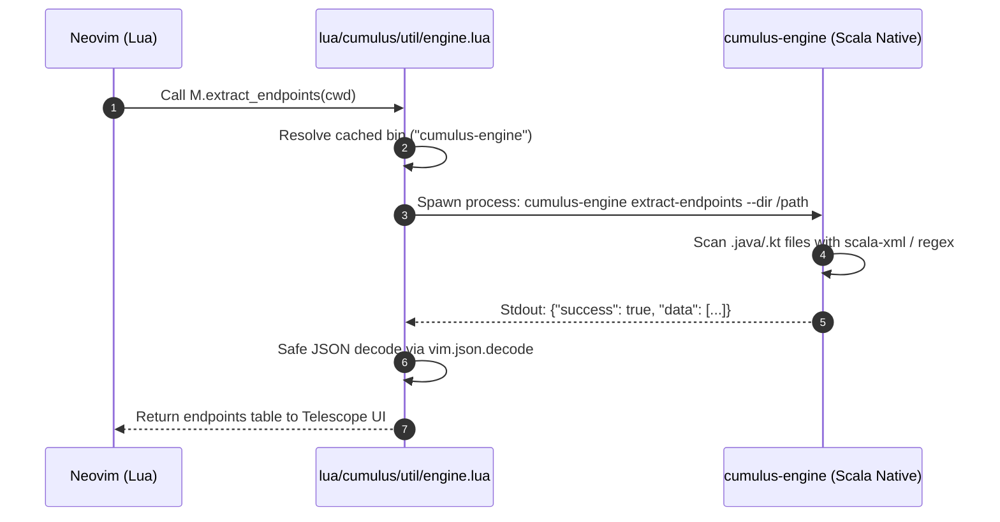

# Architecture Spine: Cumulus Scala Engine (`cumulus-engine`)

**Status**: Final
**Date**: 2026-08-13
**Author**: Winston (System Architect) & Petrolal
**Scope**: Migration of `cumulus.nvim` native binary engine from Rust (`crates/cumulus-core`) to Scala 3 + GraalVM Native Image (`engine/`).

---

## 1. Executive Summary & Paradigm

`cumulus.nvim` is a specialized Neovim distribution for JVM (Java, Kotlin, Scala, Groovy) and Cloud-Native developers (Kubernetes, Terraform, Ansible, Docker). 

This architecture spine defines the complete migration of the high-performance native helper binary from Rust to **Scala 3 + GraalVM Native Image (`cumulus-engine`)**. The engine runs as an AOT-compiled native binary, providing sub-10ms execution, zero JVM runtime requirement for end users, and total alignment with the distribution's JVM target audience.

---

## 2. Invariants & Decision Log

### AD-1: Scala 3.4+ Runtime & Language Paradigm
* **Binds**: Engine implementation language in `engine/`.
* **Prevents**: Complex Rust macro dependencies and toolchain drift for JVM maintainers.
* **Rule**: All engine code MUST be written in idiomatic Scala 3.4+, using functional case classes, top-level definitions, and macro-based JSON derivation.

### AD-2: Zero-Reflection JSON Serialization via uPickle
* **Binds**: `uPickle` (`upickle.default.*`) for all input/output JSON schemas.
* **Prevents**: Runtime GraalVM reflection crashes, binary size bloat, and `reflect-config.json` maintenance burden.
* **Rule**: All data structures serialized over stdout MUST define compile-time `ReadWriter` instances via `upickle.default.macroRW`. Reflection-based serializers (Jackson, Gson) are strictly prohibited.

### AD-3: Zero-Dependency CLI Subcommand Routing
* **Binds**: Command routing in `cumulus.Main`.
* **Prevents**: Reflection/macro overhead from third-party CLI argument parsers.
* **Rule**: Subcommand dispatching MUST use Scala pattern matching directly on `args: Array[String]`. Subcommand names MUST match `SPEC-031` subcommands 1-to-1 (`parse-pom`, `parse-gradle-tasks`, `compute-build-order`, `detect-springboot-app`, `extract-codelens`, etc.).

### AD-4: GraalVM Native Image Compilation via `sbt-native-packager`
* **Binds**: SBT build pipeline in `engine/build.sbt`.
* **Prevents**: Ad-hoc CLI build scripts and non-reproducible native compilation.
* **Rule**: Native binaries MUST be compiled using `sbt graalvm-native-image:packageBin` with `GraalVMNativeImagePlugin`.

### AD-5: Protocol Backward Compatibility (`SPEC-031`)
* **Binds**: JSON response envelope structure.
* **Prevents**: Breaking changes in the Neovim Lua integration layer.
* **Rule**: Every subcommand output MUST be wrapped in the standard `CumulusResponse[T]` envelope:
  ```json
  {
    "success": true,
    "data": { ... },
    "error": null,
    "error_code": null
  }
  ```
  Stdout is strictly reserved for the JSON payload. All log/debug text MUST go to stderr or be suppressed.

---

## 3. Engine System Topology & Module Structure

The Scala engine is located in `{project-root}/engine` and structured as follows:

```
engine/
├── build.sbt
├── project/
│   ├── build.properties
│   └── plugins.sbt              # sbt-native-packager plugin
└── src/
    ├── main/
    │   └── scala/
    │       └── cumulus/
    │           ├── Main.scala              # CLI router (args matching)
    │           ├── protocol/
    │           │   └── Envelope.scala      # CumulusResponse[T], CumulusError
    │           ├── maven/
    │           │   └── MavenParser.scala   # POM XML goals & plugin parser
    │           ├── gradle/
    │           │   ├── GradleParser.scala  # Gradle task parser
    │           │   └── WrapperVerifier.scala # Gradle wrapper & CI SHA-256 verifier
    │           ├── dag/
    │           │   └── DagSolver.scala     # Kahn's topological sort algorithm
    │           ├── codelens/
    │           │   └── CodeLensExtractor.scala # Java/Kotlin @Test/@Scheduled scanner
    │           ├── springboot/
    │           │   ├── AppDetector.scala   # Spring Boot main class & profiles
    │           │   └── BeanGraph.scala     # @Component / @Autowired dependency scanner
    │           ├── endpoints/
    │           │   └── EndpointScanner.scala # Spring / JAX-RS REST endpoint extractor
    │           ├── devops/
    │           │   ├── CoverageParser.scala  # JaCoCo XML report parser
    │           │   ├── MigrationValidator.scala # Flyway migration validator
    │           │   └── K8sValidator.scala    # Kubernetes YAML manifest validator
    │           ├── git/
    │           │   └── ConflictParser.scala  # Conflict marker parser
    │           ├── log/
    │           │   ├── LogIndexer.scala      # Log indexer for ERROR/WARN
    │           │   ├── LogParser.scala       # Build log diagnostic parser
    │           │   └── StacktraceResolver.scala # Stacktrace line-to-file symbol resolver
    │           ├── util/
    │           │   ├── ImportOptimizer.scala # Java/Kotlin import sorter
    │           │   ├── SessionSanitizer.scala# Neovim .vim session cleaner
    │           │   └── NetworkChecker.scala  # TCP socket connectivity test
    │           └── dep/
    │               ├── DepResolver.scala     # Direct dependency resolver
    │               └── DepLens.scala         # Dependency version age lens
    └── test/
        └── scala/
            └── cumulus/                  # Munit / ScalaTest unit tests
```

---

## 4. Lua Bridge & Neovim Integration

1. **Bridge Module Update**:
   - `lua/cumulus/util/rust.lua` is replaced/renamed to `lua/cumulus/util/engine.lua`.
   - Executable search targets: `cumulus-engine` on `$PATH`, `engine/target/graalvm-native-image/cumulus-engine`, or `engine/target/universal/stage/bin/cumulus-engine`.
2. **Health Check Update**:
   - `lua/cumulus/health.lua` updated to check `cumulus-engine` status via `sbt graalvm-native-image:packageBin`.
3. **Rust Purge**:
   - Delete `crates/cumulus-core/`.
   - Remove `cargo` binary dependencies from `health.lua` and documentation.

---

## 5. Sequence Diagram: Neovim $\rightarrow$ Scala Engine Execution



---

## 6. Deferred / Open Items

* **Cross-Platform Pre-built Release Binaries**: Automated GitHub Actions CI workflow to compile and upload pre-built `cumulus-engine` binaries for x86_64-linux, aarch64-linux, and darwin-arm64.
