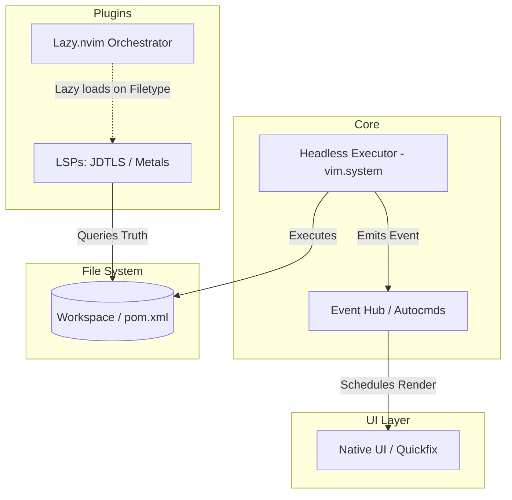

# Architecture Spine: Cumulus.nvim

**Paradigm:** Event-Driven, Stateless UI Architecture  
**Primary Driver:** Absolute editor stability and zero-blocking UI constraints during heavy JVM/Cloud operations.

## Architectural Decisions (Invariants)

### AD-01: Event-Driven UI Paradigm
- **Rule:** Core logic, external executors, and DevOps bridges must emit Neovim autocommands (`vim.api.nvim_exec_autocmds`) rather than directly calling UI render functions. UI components listen for these events and schedule their renders asynchronously (`vim.schedule`).
- **Binds:** All background operations, build runners, and LSP response handlers.
- **Prevents:** Direct imperative UI updates from background tasks that could freeze the editor thread.

### AD-02: Decentralized Plugin Orchestration
- **Rule:** Plugin configurations must be isolated by filetype or specific command via `Lazy.nvim`. There is no global "LSP monolith" file.
- **Binds:** All files under `lua/cumulus/plugins/`.
- **Prevents:** Centralized monolithic configs and global startup memory bloat when editing non-JVM files.

### AD-03: Headless External Tooling
- **Rule:** Heavy external commands (Maven/Gradle builds, project generation, DevOps scripts) must run headlessly via `vim.system`. Results and errors are captured and piped to native Neovim UI elements (Quickfix, notifications).
- **Binds:** The core external command executor utility.
- **Prevents:** Relying on raw `:terminal` splits for standard tool execution.

### AD-04: Stateless Project Context
- **Rule:** Cumulus maintains zero internal cache of the workspace topology. Project context (dependencies, main classes, project type) is queried on the fly from the file system (e.g., parsing `pom.xml`) or synchronously from the LSP.
- **Binds:** Any feature or utility requiring project knowledge.
- **Prevents:** Global in-memory state caches, desync bugs, and the use of flaky Neovim file-watchers.

## Structural Seed

## Deferred Decisions
- **Specific Notification UI Plugin:** Whether to use `noice.nvim`, `snacks.nvim`, or standard `vim.notify` is left to implementation, as long as it adheres to the headless event-driven paradigm (AD-01, AD-03).
- **Maven/Gradle Generator Implementation Details:** The exact Telescope layout and archetype fetching mechanism is deferred to the specific epic/feature design.
