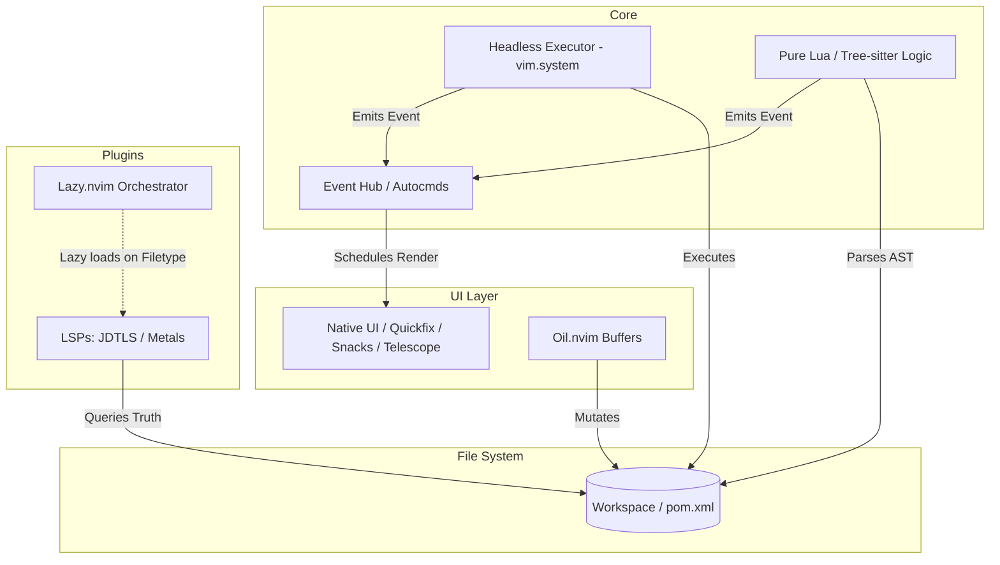

# Architecture Spine: TetraVim.nvim

**Paradigm:** Event-Driven, Stateless UI Architecture  
**Primary Driver:** Absolute editor stability, native Neovim standards, and zero-blocking UI constraints during heavy JVM/Cloud operations.

## Architectural Decisions (Invariants)

### AD-01: Event-Driven UI Paradigm
- **Rule:** Core logic, external executors, and DevOps bridges must emit Neovim autocommands (`vim.api.nvim_exec_autocmds`) rather than directly calling UI render functions. UI components listen for these events and schedule their renders asynchronously (`vim.schedule`).
- **Binds:** All background operations, build runners, and LSP response handlers.
- **Prevents:** Direct imperative UI updates from background tasks that could freeze the editor thread.

### AD-02: Decentralized Plugin Orchestration
- **Rule:** Plugin configurations must be isolated by filetype or specific command via `Lazy.nvim`. There is no global "LSP monolith" file.
- **Binds:** All files under `lua/tetravim/plugins/`.
- **Prevents:** Centralized monolithic configs and global startup memory bloat when editing non-JVM files.

### AD-03: Headless External Tooling
- **Rule:** Heavy external commands (Maven/Gradle builds, project generation, DevOps scripts) must run headlessly via `vim.system`. Results and errors are captured and piped to native Neovim UI elements (Quickfix, notifications).
- **Binds:** The core external command executor utility.
- **Prevents:** Relying on raw `:terminal` splits for standard tool execution.

### AD-04: Stateless Project Context
- **Rule:** TetraVim maintains zero internal cache of the workspace topology. Project context (dependencies, main classes, project type) is queried on the fly from the file system (e.g., parsing `pom.xml`) or synchronously from the LSP.
- **Binds:** Any feature or utility requiring project knowledge.
- **Prevents:** Global in-memory state caches, desync bugs, and the use of flaky Neovim file-watchers.

### AD-05: Buffer-Based Explorer Workflows
- **Rule:** Directory navigation and file management must be handled via `oil.nvim`, treating the file system as standard Neovim buffers.
- **Binds:** File management and project exploration features.
- **Prevents:** Stateful, traditional sidebar abstraction layers (e.g., `neo-tree`) that deviate from standard Neovim mode interactions.

### AD-06: Direct UI Coupling
- **Rule:** Feature modules should call UI primitives (`snacks.nvim`, `telescope.nvim`) directly.
- **Binds:** Any feature presenting data to the user.
- **Prevents:** Over-engineered facade or adapter layers (`tetravim.ui`) intended to "future-proof" UI framework swaps.

### AD-07: Strict Native Intelligence
- **Rule:** New feature logic, AST parsing, and project discovery must be implemented in pure Lua (leveraging Tree-sitter) or delegated to standard LSPs.
- **Binds:** All new feature development (e.g., Spring endpoint discovery).
- **Prevents:** Adding any new surface area to the legacy Scala `tetravim-engine` or introducing external Bash/Python parsing scripts.

## Structural Seed

## Deferred Decisions
- **Legacy Engine Cleanup:** The exact timeline and method for ripping out the remaining `engine.lua` facade is deferred to a future epic, provided AD-07 prevents it from growing.
