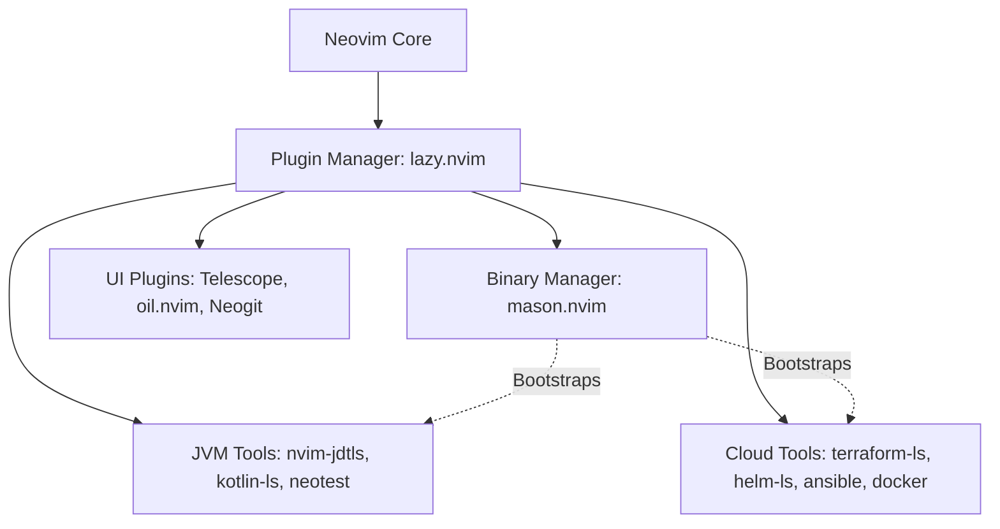

# Architecture Spine — Cumulus Neovim Distro

## Design Paradigm

**Monolithic Plugin Distribution with Lazy Loading**
The architecture is a single, unified codebase managed by `lazy.nvim` and `mason.nvim`. All features (JVM and Cloud) are enabled out of the box to provide a cohesive, enterprise-ready IDE experience. Lazy loading is heavily utilized to maintain fast startup times, ensuring the "default Neovim philosophy" of speed and responsiveness is preserved.

## Invariants & Rules

### AD-1 — Package & Binary Management
- **Binds:** All external dependencies (LSPs, DAPs, formatters, linters)
- **Prevents:** Drift in developer environments and manual installation steps.
- **Rule:** All external binaries MUST be managed and bootstrapped via `mason.nvim`. System-level dependencies should be avoided unless strictly necessary (e.g., a base Java or Node installation).

### AD-2 — Keybinding Convention
- **Binds:** All plugin configurations and custom mappings.
- **Prevents:** Conflicting keymaps and non-standard muscle memory.
- **Rule:** Must adhere to traditional mnemonic Neovim conventions. The `<leader>` key is the primary prefix (e.g., `<leader>f` for find/Telescope, `<leader>l` for LSP, `<leader>g` for Git).

### AD-3 — Java LSP Integration
- **Binds:** Java language support.
- **Prevents:** Broken workspace and project management in large enterprise Java codebases.
- **Rule:** Must use `nvim-jdtls` directly instead of configuring `jdtls` through standard `nvim-lspconfig`.

### AD-4 — UI & Navigation Standardization
- **Binds:** File exploration, fuzzy finding, and Git operations.
- **Prevents:** Fragmented workflows and redundant plugins.
- **Rule:** Standardize on `telescope.nvim` for search/fuzzy finding, `oil.nvim` for buffer-based file exploration, and `Neogit` for version control.



## Consistency Conventions

| Concern | Convention |
| --- | --- |
| Naming (entities, files) | Standard Lua module naming (e.g., `lua/cumulus/plugins/jvm.lua`) |
| Keymaps | `which-key.nvim` integration is required for all `<leader>` bindings to ensure discoverability. |
| Lazy Loading | Plugins must define `cmd`, `ft`, or `keys` triggers where possible; avoid `lazy = false` unless critical for startup. |

## Stack

| Name | Version |
| --- | --- |
| Neovim | >= 0.9.0 |
| lazy.nvim | latest |
| mason.nvim | latest |
| nvim-jdtls | latest |
| neotest | latest |
| telescope.nvim | latest |
| oil.nvim | latest |
| Neogit | latest |

## Structural Seed

```text
/
  init.lua                  # Entry point, sets up leader key and bootstraps lazy.nvim
  lua/
    cumulus/
      core/
        options.lua         # Base vim options
        keymaps.lua         # Global keymaps
      plugins/
        ui.lua              # oil.nvim, lualine, etc.
        editor.lua          # telescope, treesitter
        lsp.lua             # mason, lspconfig
        java.lua            # nvim-jdtls specific config
        cloud.lua           # terraform, helm, docker configs
        git.lua             # neogit
```

## Deferred

- **Strict Declarative Environments (Nix/Devcontainers):** Deferred. Currently relying on Mason for ease of use, but enterprise deployment may later require strict Nix flakes or Devcontainer definitions if Mason proves insufficient for isolated, highly restricted corporate networks.
